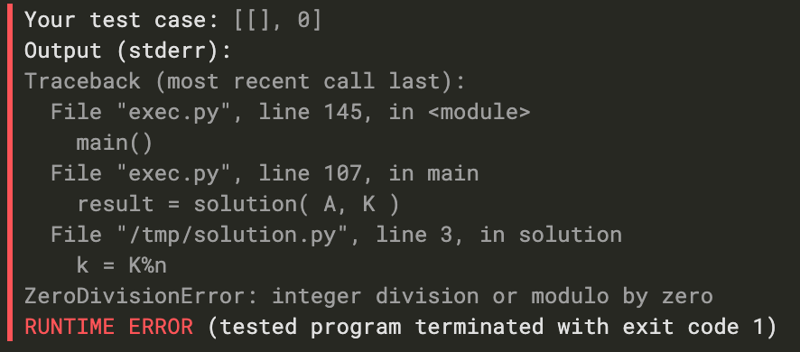
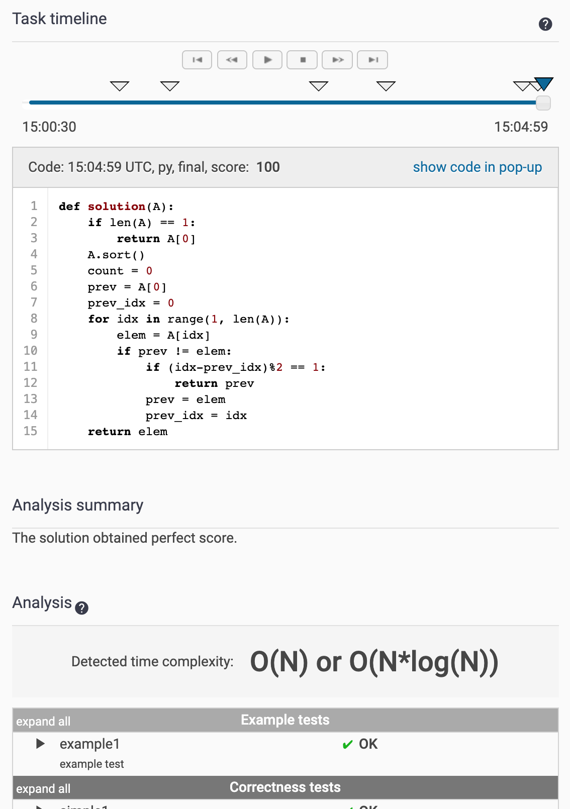

## 1. [CyclicRotation](https://app.codility.com/programmers/lessons/2-arrays/cyclic_rotation/)

```python
def solution(A, K):
    n = len(A)
    if not n:
        return A
    k = K%n
    answer = A[:] #(1)
    for i in range(n):
        answer[(i+k)%n] = A[i]
    return answer
```

모듈러 연산 사용하는 문제.

배열의 길이가 10이면, 10번 rotate를 하면 제자리로 온다. 즉, K번의 연산은 K%len(A) 번의 연산과 동일하다.

(1) 슬라이싱을 통해 배열을 앝은 복사한 후

(2) 인덱스만큼 돌면서 복사한 배열의 인덱스에 원래 값을 덮어써준다.

조심할 점: 0으로 모듈러 연산하면 에러난다. 빈 배열일 경우의 방어코드가 필요하다. 




## 2. [OddOccurrencesInArray](https://app.codility.com/programmers/lessons/2-arrays/odd_occurrences_in_array/)

효율성 제한이 있는 문제.

```python
def solution(A):
    if len(A) == 1:
        return A[0]
    A.sort() #(1)
    count = 0
    #(2)
    prev = A[0]
    prev_idx = 0
    for idx in range(1, len(A)):
        elem = A[idx]
        if prev != elem:
            if (idx-prev_idx)%2 == 1:
                return prev
            prev = elem
            prev_idx = idx
    return elem
```

코딜리티 한번에 ac 받기 힘들다. 아니면 내가 그냥 못 짜는 걸수도... :)

카운터 객체를 이용할 수도 있을 것 같지만, 나는 그냥 sort를 이용했다.

(1) A 배열을 정렬한다.

(2) 배열의 첫째 요소의 idx (=0), 값을 각각 prev_idx, prev로 저장해둔다.

(3) 앞에서부터 돌면서, 현재 값이 이전 값과 달라질 때마다 다음을 체크한다.

- prev_idx부터 지금까지의 간격이 홀수인지
  - 홀수라면 prev 값을 가진 애가 홀수개 있는 것. 바로 리턴한다.
  - 아니라면 prev와 prev_idx 값을 업데이트 해주고 반복한다.

이런 문제를 풀 때 항상 조심해야 하는 것은 **끝 값 처리**이다. 뭔가 배열을 돌면서 이전 값과 달라졌을 때 어떤 처리를 (ex.업데이트) 해주는 로직은, 항상 정답 케이스가 맨 마지막에 위치하지만 - 배열이 끝나서 로직에 포함이 안되는 경우를 꼭 생각해야 한다.

예를 들어, `[2,2,3,3,4,4,4]` 이렇게 최댓값 4가 홀수일 경우, 4는 sort했을 때 맨 마지막에 있고 `prev != elem` 로직을 타지 못하고 for문이 끝난다.

따라서 early return이 되지 않았다면 이는 마지막 diff 비교까지 홀수 갯수를 가진 값이 나오지 않았다는 것을 의미하고, 즉 마지막 값이 홀수 갯수를 가졌다는 말이다.

(4) early return이 되지 않았다면 elem(=마지막 값)을 리턴한다.


조심할 점: 배열 길이 1일때 예외 케이스 처리, 끝 값 처리

코딜리티는 아래처럼 코드 입력 timeline과 예상 효율성 분석 결과도 보여준다. 짱짱맨임.

