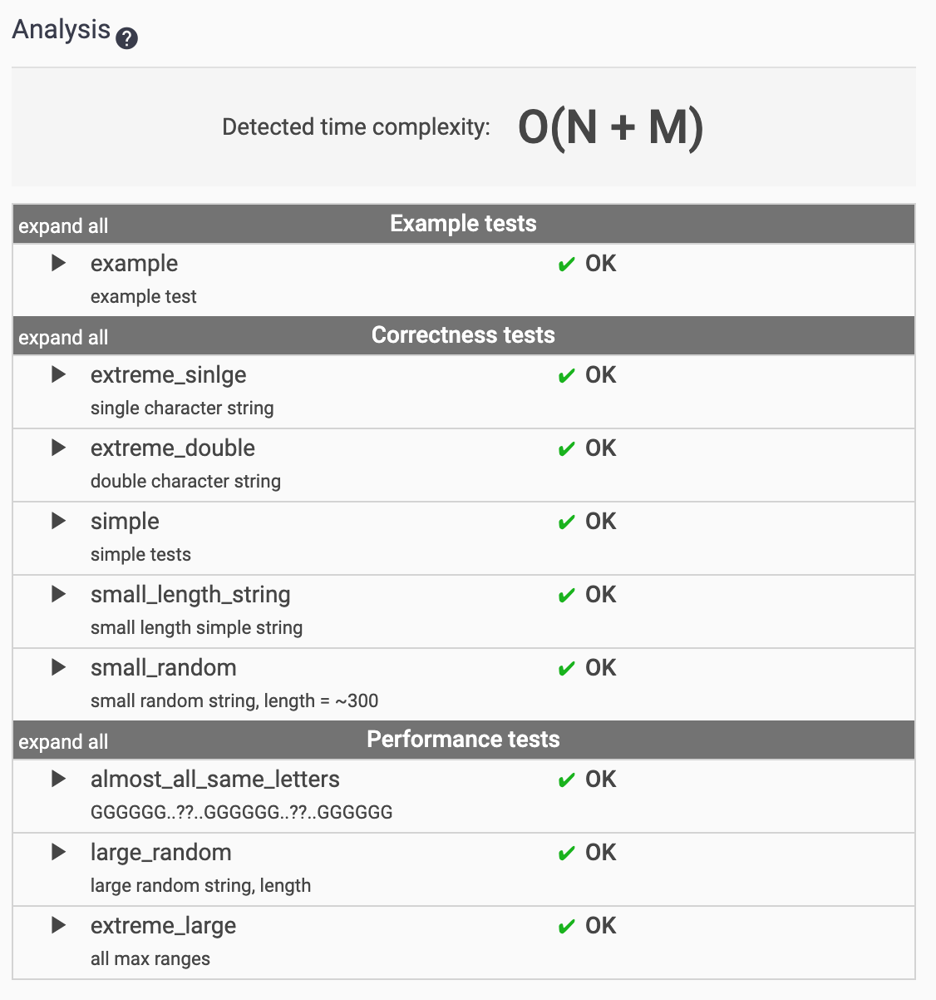

# [CountDiv](https://app.codility.com/programmers/lessons/5-prefix_sums/count_div/)

```python
import math

def solution(A, B, K):
    if (B-A<K):
      	#(1)
        if B%K == 0 or A%K == 0:
            return 1
        else:
            return 0
    return (B//K)-math.ceil(A/K)+1
```

나는야 삽질 대마왕 💪

`Math.ceil(A//K)` 을 해놓고 어라라...왜 올림이 안될까요...이러고 있었다. 파이썬의 `//` 연산자에 너무 익숙해져있던 나머지 `//` 가 나머지를 버려버린다는걸 망각했다.

input 사이즈가 2,000,000,000 으로, 그냥 포문으로 구하면 당연히 시간초과가 난다.

따라서 (1)양 끝값의 몫의 차로 접근해야 한다. 여기까지는 처음에 쉽게 접근했는데, 한가지 주의해야 할 부분이 있다. (2)B와 A의 간격이 K보다 작을 때이다. 이때는 양 끝값의 나머지를 체크해서 K가 포함되는지를 봐야 한다. B와 A의 간격이 K보다 작다면 많아야(=양 끝값 중 하나가 K로 나눠떨어져야) 1개의 K로 나눠떨어지는 수를 포함할 수 있다.


# [GenomicRangeQuery](https://app.codility.com/programmers/lessons/5-prefix_sums/genomic_range_query/)

어렵다...! 😨




O(N+M)의 시간복잡도가 나와야 ac를 받을 수 있다.

```python
def get_idx(s):
    if s == "A":
        return 1
    if s == "C":
        return 2
    if s == "G":
        return 3
    if s == "T":
        return 4
             
def solution(S, P, Q):
    answer = [0 for i in range(len(P))]
    #(1)
    arr = [[-1 for _ in range(5)] for i in range(len(S))]
    arr[0][get_idx(S[0])] = 0
    for i in range(1,len(S)):
        arr[i] = arr[i-1][:]
        #(2)
        arr[i][get_idx(S[i])] = i
    for j in range(len(P)):
        for k in range(1,5):
            if arr[Q[j]][k] >= P[j]:
                answer[j] = k
                break
    return answer
```

힌트는 고려해야 할 대상이 A,C,G,T 4개 뿐으로 아주 적은 종류라는 것에 있다.

내가 택한 방법은 아래와 같다.

1. P의 길이만큼 **A,C,G,T가 마지막으로 등장한 Idx를 저장할 ** length 5짜리 (impact num 1~4를 저장해야 하므로) 배열을 만든다. 초기값은 -1로 초기화한다.
2. S를 처음부터 돌면서, 현재 나온 char의 impact num 위치에 현재 idx를 저장한다.

이렇게 arr을 완성하면, 한 예로 arr[5] 가 [-1,2,3,4] 라면 impact num이 1인 A는 마지막으로 등장한 idx가 2이고, impact num이 2인 C는 마지막으로 등장한 idx가 3이고... 이런 정보를 저장할 수 있게 된다.

그럼 이제 P,Q의 정보를 가지고 어떻게 할 것이냐? 인덱스가 Q[k]인 arr의 값을 읽으면 P[k] 시점에서 A,C,G,T가 마지막으로 등장한 Idx를 알 수 있다. 우리는 최소값을 구하고 있기에 arr[P[k]]에서 A 즉 idx 1부터~4까지 읽으며 값이 P[k] 보다 같거나 큰 = 즉 P[k] 이후에 마지막으로 등장한 알파벳의 숫자를 answer로 넣어준다.

문제의 예시 문자열인 `"CAGCCTA"` 를 넣으면 아래와 같은 arr이 완성된다.

```
[[-1, -1, 0, -1, -1], [-1, 1, 0, -1, -1], [-1, 1, 0, 2, -1], [-1, 1, 3, 2, -1], [-1, 1, 4, 2, -1], [-1, 1, 4, 2, 5], [-1, 6, 4, 2, 5]]
[2, 4, 1]
```

arr[6]의 [-1,6,4,2,5]의 의미는 idx1인 A가 S[6]에 마지막으로 나왔고, C는 S[4]에 마지막으로 나오고... 고런 의미다. 다시 보니 궂이 5짜리 배열이 아니라 4짜리로 관리했어도 됐겠다.


[누적합을 사용하는 방법]

출처: https://nachwon.github.io/GenomicRangeQuery/

내가 푼 방법보다 더 직관적인 방법은 누적합을 사용하는 방법이다.

S를 처음부터 돌면서, 나온 요소들의 Impact num 인덱스 카운터를 1씩 증가시킨다. 그리고 나중에 Q[k]의 카운터-P[k]의 카운터를 하면 사이에 몇개의 요소가 나왔는지 알 수가 있다!

누적합의 개념은 알고 있지만 누적합으로 푸는게 도통 생각이 안났었는데, 재밌는 문제인 것 같다.


# [MinAvgTwoSlice](https://app.codility.com/programmers/lessons/5-prefix_sums/min_avg_two_slice/)

모르게쒀요...내 최선은 60%였다. 답 찾아봄.

출처: https://nukeguys.tistory.com/175

신기한 문제로다...약간 수학적인 번뜩임이 필요한 문제인 것 같다..나에겐 없는 수학적인 번뜩임...


# [PassingCars](https://app.codility.com/programmers/lessons/5-prefix_sums/passing_cars/)

```python
def solution(A):
    count = 0
    prefix_sum = 0
    if A[0] == 0:
        count += 1
    for i in A[1:]:
        if i == 0:
            count += 1
        else:
            prefix_sum += count
            if prefix_sum >1000000000:
                return -1
    return prefix_sum
```

전형적인 누적합 문제. 첫 시작이 0인지 1인지 체크해주고, 1000000000을 넘었을 때 -1을 잘 리턴해주면 문제 없다. 

0은 count를 늘리는 역할을 하고, 1은 그 count만큼 누적합에 더하는 역할을 한다.


