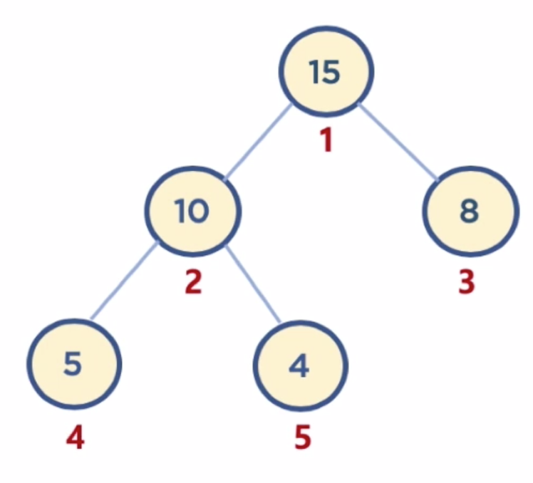

# Heap


### 힙 : 데이터에서 최대/최소 값을 빠르게 찾기 위해 고안된 완전 이진 트리

사용하는 이유: 힙에 데이터를 넣고, 최대값과 최소값을 찾으면 O(logn)의 시간복잡도를 가짐. (배열은 O(n)) 따라서 우선순위 큐와 같이 최대/최소 값을 빠르게 찾아야 하는 자료구조 및 알고리즘 구현 등에 활용됨.


### 힙의 구조

최대값을 구하기 위한 Max Heap 과 최소값을 구하기 위한 Min Heap 으로 분류할 수 있음.
힙은 다음과 두 가지 조건을 가지고 있는 자료구조

  1. 각 노드의 값은 해당 노드의 자식 노드가 가진 값보다 크거나 같다. (최대 힙의 경우)
    
     - 최소 힙의 경우는 각 노드의 값은 해당 노드의 자식 노드가 가진 값보다 크거나 작음
     
  2. 완전 이진 트리 형태를 가짐
     - 완전 이진 트리 : 노드를 삽입할 때 최하단 왼쪽 노드부터 차례대로 삽입하는 트리
     
       
     

### 힙의 데이터 삽입하기

먼저 삽입된 데이터는 완전 이진 트리의 구조에 맞춰 최하단 왼쪽 노드부터 차례대로 채워짐.
채워진 후, 부모 노드보다 값이 클 경우 (Max Heap 의 경우) 부모 노드와 위치를 바꿔주는 작업(swap)을 반복함.


### 힙의 데이터 삭제하기

보통 힙에서의 삭제는 최상단 root node 를 삭제하는 것이 일반적임. (힙의 용도가 최대/최소값을 root에 놓아서 바로 꺼내 쓸 수 있도록 하는 것이기 때문)
root node 삭제 시, 가장 마지막에 추가한 노드를 root node로 이동시킴.
root node 의 값이 child node 보다 작을 경우, root node의 child node 중 가장 큰 값을 가진 노드와  root node 위치를 바꿔주는 작업(swap)을 반복함.


### 배열을 활용한 힙 구현

일반적으로 힙을 구현 시 **배열** 자료구조를 많이 활용함.
-> 그 이유는 힙이 완전 이진 트리이기 때문! 최하단 왼쪽 노드부터 **차례차례 순차적**으로 채워지므로 순서가 있는 배열을 활용하면 좋다.

  

배열은 인덱스가 0부터 시작하지만, 힙 구성의 편의를 위해 root 노드 인덱스 번호를 1로 지정하면 구현이 조금 더 수월함.

- **부모 노드** 인덱스 번호: 자식 노드 인덱스 번호 // 2

- **왼쪽 자식 노드** 인덱스 번호: 부모 노드 인덱스 번호 * 2

- **오른쪽 자식 노드** 인덱스 번호: 부모 노드 인덱스 번호 * 2 + 1																									
  위 식을 가지고 관계된 노드들의 인덱스 번호를 알 수 있다.

```python
# 힙 클래스 만들기
class Heap:
    def __init__(self, data):
        self.heap_array = list()
        self.heap_array.append(None) # 첫 번째 데이터의 인덱스를 1로 하기 위해
        self.heap_array.append(data)

    def move_up(self, inserted_idx):
        # 현재 노드가 root 노드이면 그만
        if inserted_idx <= 1:
            return False
        parent_idx = inserted_idx // 2
        # 현재 노드가 부모 노드보다 값이 크면 계속 move up
        if self.heap_array[inserted_idx] > self.heap_array[parent_idx] :
            return True
        else:
            return False

    def move_down(self, popped_idx):
        left_child_popped_idx = popped_idx * 2
        right_child_popped_idx = popped_idx * 2 + 1
        # case1: 자식 노드가 하나도 없을 때 (왼쪽 자식 노드X)
        if left_child_popped_idx >= len(self.heap_array): # left_child_popped_idx 가 전체 길이 (= 마지막 노드 인덱스) 보다 더 큰, 없는 곳을 가르키고 있다면
            return False
        # case2: 자식 노드가 하나 있을 때 (왼쪽 O, 오른쪽 X)
        elif right_child_popped_idx >= len(self.heap_array):
            if self.heap_array[popped_idx] < self.heap_array[left_child_popped_idx]:
                return True
            else:
                return False
        # case3: 자식 노드가 둘 다 있을 때
        else:
            if self.heap_array[left_child_popped_idx] > self.heap_array[right_child_popped_idx]:
                if self.heap_array[popped_idx] < self.heap_array[left_child_popped_idx]:
                    return True
                else:
                    return False
            else:
                if self.heap_array[popped_idx] < self.heap_array[right_child_popped_idx]:
                    return True
                else:
                    return False

    def insert(self, data):
        if len(self.heap_array) == 0:
            self.heap_array.append(None)
            self.heap_array.append(data)
            return True
        self.heap_array.append(data)  # 완전 이진 트리이므로 데이터 추가하는건 여기서 끝남. 지금부터는 바꿔주는 과정

        inserted_idx = len(self.heap_array) - 1

        while self.move_up(inserted_idx):
            parent_idx = inserted_idx // 2
            self.heap_array[inserted_idx], self.heap_array[parent_idx] = self.heap_array[parent_idx] , self.heap_array[inserted_idx] # swap
            inserted_idx = parent_idx
        return True

    def pop(self):
        if len(self.heap_array) <= 1:
            return None

        returned_data = self.heap_array[1] # 1번 인덱스에 위치한 데이터가 항상 최대/최소 값
        self.heap_array[1] = self.heap_array[-1] # 마지막 노드를 root 노드 값으로 덮어씌워주기
        del self.heap_array[-1]
        popped_idx = 1

        while self.move_down(popped_idx):
            left_child_popped_idx = popped_idx * 2
            right_child_popped_idx = popped_idx * 2 + 1
            # 자식 노드가 하나 있을 때
            if right_child_popped_idx > len(self.heap_array):
                if self.heap_array[popped_idx] < self.heap_array[left_child_popped_idx]:
                    self.heap_array[popped_idx], self.heap_array[left_child_popped_idx] = self.heap_array[left_child_popped_idx], self.heap_array[popped_idx]
                    popped_idx = left_child_popped_idx
            # 자식 노드가 두개 있을 때
            else:
                if self.heap_array[left_child_popped_idx] > self.heap_array[right_child_popped_idx]:
                    if self.heap_array[popped_idx] < self.heap_array[left_child_popped_idx]:
                        self.heap_array[popped_idx], self.heap_array[left_child_popped_idx]  = self.heap_array[left_child_popped_idx], self.heap_array[popped_idx]
                        popped_idx = left_child_popped_idx
                else:
                    if self.heap_array[popped_idx] < self.heap_array[right_child_popped_idx]:
                        self.heap_array[popped_idx], self.heap_array[right_child_popped_idx] = self.heap_array[right_child_popped_idx], self.heap_array[popped_idx]
                        popped_idx = right_child_popped_idx
        return returned_data


heap = Heap(1)
heap.insert(5)
heap.insert(20)
heap.insert(4)
heap.insert(2)
heap.insert(30)
print(heap.heap_array)
heap.pop()
print(heap.heap_array)
heap.pop()
print(heap.heap_array)
```


### 힙의 시간 복잡도

데이터 추가/삭제 시 항상 자식 노드와 비교함. 최악의 경우 root 노드부터 leaf 노드까지, depth 만큼 비교해야하므로 시간 복잡도는 O(log n)