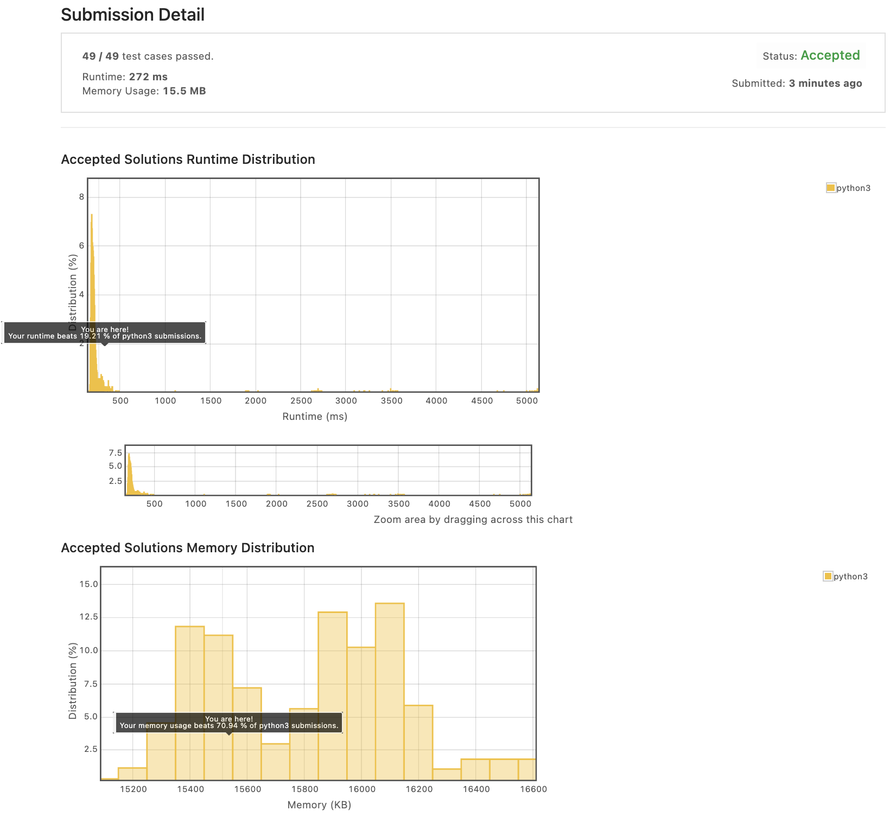
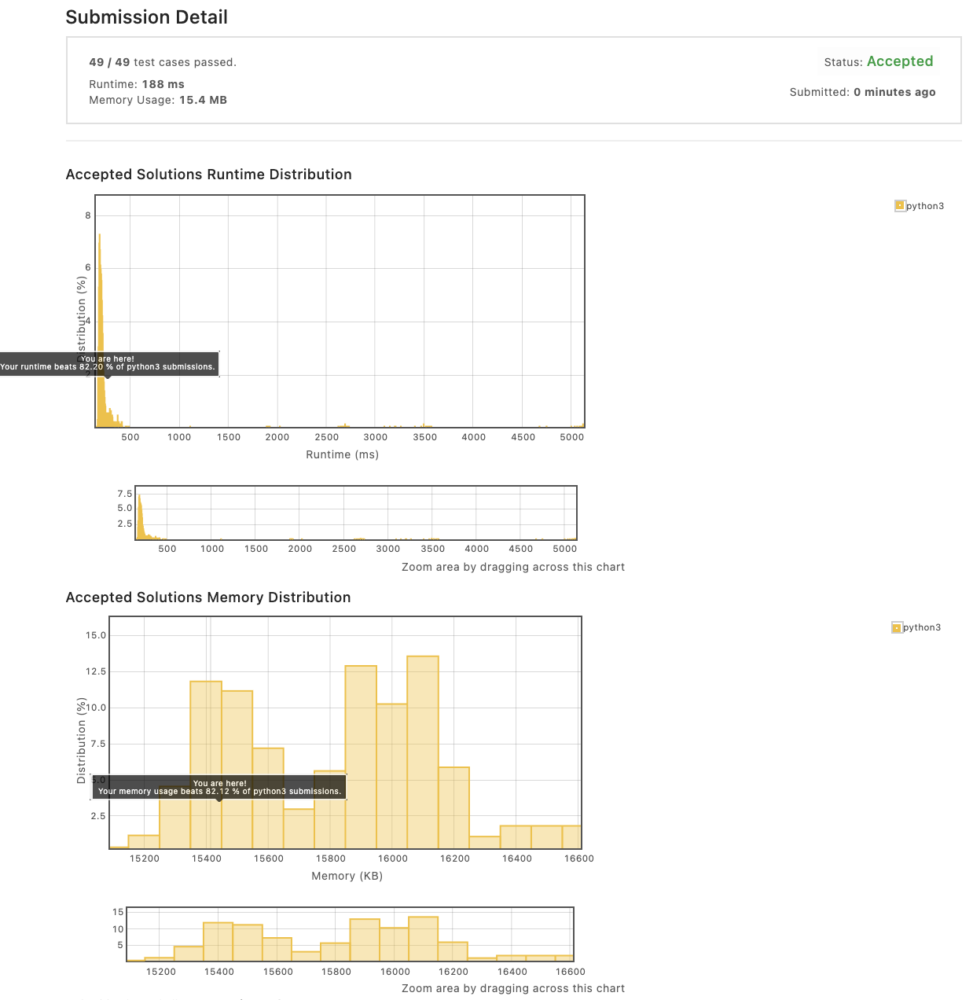

# Week 1

## [Set Mismatch](https://leetcode.com/explore/featured/card/march-leetcoding-challenge-2021/588/week-1-march-1st-march-7th/3658/)

### 제출 답

```python
class Solution:
    def findErrorNums(self, nums: List[int]) -> List[int]:
        nums.sort()
        S = sum(list(range(1, len(nums)+1)))
        s = sum(nums)
        duplicated_num = None
        for i in range(1, len(nums)):
            if nums[i] == nums[i-1]:
                duplicated_num = nums[i]
        return [duplicated_num, S-s+duplicated_num]
```

어떻게 잘 풀지 고민하다가...생각보다 실수도 많이 하고 시간도 좀 썼다.

- 리빙포인트: nums가 "순차적으로" 들어오지 않음

결과는...? 놀랍게도 느리다 🥲 주륵 생각해보니 sort 해서 어짜피 O(n) 먹고 가느니 그냥 for로 한번만 돌아버리는게 나았겠네.



### 제출 답 #2

```python
class Solution:
    def findErrorNums(self, nums: List[int]) -> List[int]:
        chk = list(range(1,len(nums)+1))
        duplicate_num = 0
        for i in range(len(nums)):
            if chk[nums[i]-1] == 0:
                duplicate_num = nums[i]
            else:
                chk[nums[i]-1] = 0
        return [duplicate_num, sum(chk)]
```

진작 이렇게 할걸...🥲 for문 한번에, 마지막에 sum 하니까 대충 O(n)이다.



