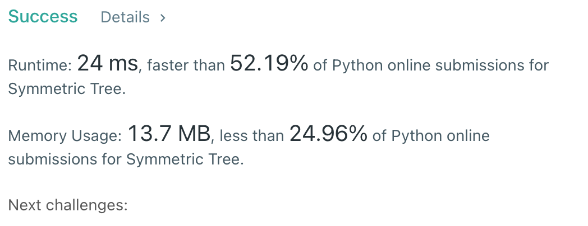

# [101] Symmetric Tree

## Info

### 결과값

| 항목        | 평가                             |
| ----------- | -------------------------------- |
| 통과        | **AC** WA                        |
| 문제 난이도 | **Easy** Medium Hard             |
| 체감 난이도 | Easy **Medium** Hard             |
| 언어        | C C++ Java **Python** Javascript |
| 해결 시간   | 1시간                            |
| 시간복잡도  | O(n)                             |

## Result



## Solving

dfs로 풀되, root 노드 기준 왼쪽 자식은 자기자신>왼쪽 subtree>오른쪽 subtree로 방문하고, 오른쪽 자식은 자기자신>오른쪽 subtree>왼쪽 subtree으로 방문하도록 풀었다. left_arr, right_arr에 방문 순서를 저장해두고 비교하는 식으로 풀었다.

## Source

```python
# Definition for a binary tree node.
# class TreeNode(object):
#     def __init__(self, val=0, left=None, right=None):
#         self.val = val
#         self.left = left
#         self.right = right

class Solution(object):
    def left_dfs(self, root, node, left_arr):
        if node == None:
            left_arr.append(None)
            return
        left_arr.append(node.val)
        if node.left == None and node.right == None:
            return
        self.left_dfs(root, node.left, left_arr)
        self.left_dfs(root, node.right, left_arr)
    
    def right_dfs(self, root, node, right_arr):
        if node == None:
            right_arr.append(None)
            return
        right_arr.append(node.val)
        if node.left == None and node.right == None:
            return
        self.right_dfs(root, node.right, right_arr)
        self.right_dfs(root, node.left, right_arr)

    def isSymmetric(self, root):
        left_arr, right_arr = [],[]
        self.left_dfs(root, root.left, left_arr)
        self.right_dfs(root, root.right, right_arr)
        for i in range(len(left_arr)):
            if left_arr[i] != right_arr[i]:
                return False
        return True
```

