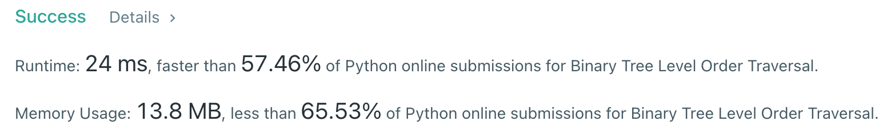

# [102] Binary Tree Level Order Traversal

## Info

### 결과값

| 항목        | 평가                             |
| ----------- | -------------------------------- |
| 통과        | **AC** WA                        |
| 문제 난이도 | Easy **Medium** Hard             |
| 체감 난이도 | **Easy** Medium Hard             |
| 언어        | C C++ Java **Python** Javascript |
| 해결 시간   | 약 10분                          |
| 시간복잡도  | O(V+E)                           |

## Result



## Solving

111번이랑 거의 비슷하게 deque를 사용한 BFS로 풀었습니다.

## Source

```python
from collections import deque


class Solution(object):
    def levelOrder(self, root):
        answer = []
        depth = 0
        if root:
            q = deque([[root, depth]])
            while q:
                curr, d = q.popleft()
                if len(answer) <= d:
                    answer.append([curr.val])
                else:
                    answer[d].append(curr.val)
                if curr.left:
                    q.append([curr.left, d+1])
                if curr.right:
                    q.append([curr.right, d+1])
        else:
            return []
        return answer
```

