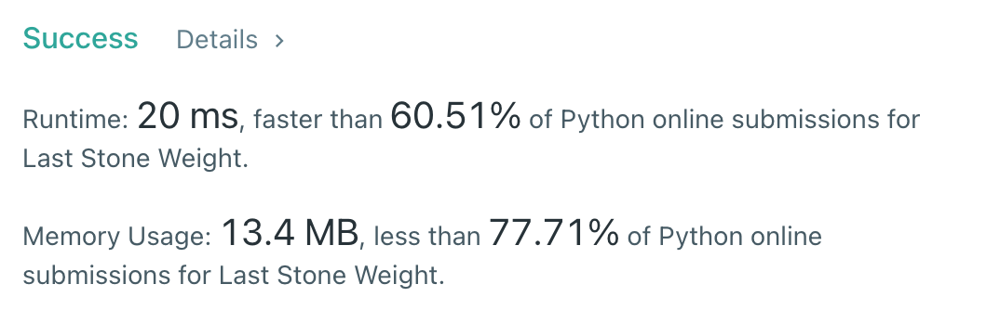

# [1046] Last Stone Weight

## Info

### 결과값

| 항목        | 평가                             |
| ----------- | -------------------------------- |
| 통과        | **AC** WA                        |
| 문제 난이도 | **Easy** Medium Hard             |
| 체감 난이도 | **Easy** Medium Hard             |
| 언어        | C C++ Java **Python** Javascript |
| 해결 시간   | 약 10분                          |
| 시간복잡도  | O(n^2)...?                       |

## Result



## Solving

처음에 stones를 정렬하고, stones 배열의 길이가 1 이하가 될때까지 뒤의 2개 원소들을 잘라나가면서 계산해줬다.

smashed된 결과를 insert 할때는 앞에서부터 단순 순차탐색.

## Source

```python
class Solution(object):
    def lastStoneWeight(self, stones):
        stones.sort()
        while len(stones) > 1:
            smashed = stones[-1]-stones[-2]
            stones = stones[:-2]
            if smashed != 0:
                inserted = False
                for idx in range(len(stones)):
                    if stones[idx] >= smashed:
                        stones.insert(idx, smashed)
                        inserted = True
                        break
                if not inserted:
                    stones.append(smashed)
        if len(stones) == 1:
            return stones[0]
        else:
            return 0
```