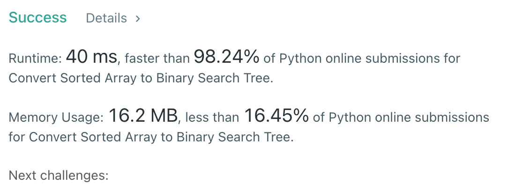

# [108] Convert Sorted Array to Binary Search Tree

## Info

### 결과값

| 항목        | 평가                             |
| ----------- | -------------------------------- |
| 통과        | **AC** WA                        |
| 문제 난이도 | **Easy** Medium Hard             |
| 체감 난이도 | Easy **Medium** Hard             |
| 언어        | C C++ Java **Python** Javascript |
| 해결 시간   | 약 1시간                         |
| 시간복잡도  | O(V+E)                           |

## Result



## Solving

height-balanced binary search tree를 어떻게 만드나...고민을 좀 하다가 nums가 정렬되어 있으므로 항상 root를 중간값으로 두고, 중간값보다 작은 수들을 left subtree로, 큰 수들을 right subtree로 두고 재귀적으로 트리를 만들면 항상 균형잡힌 트리가 나올거라는 생각을 했습니다.

재귀를 오랜만에 풀어서 어떻게 구현해야 할지 조금 고민을 했는데, 맞게 짠 것인지 모르겠습니다..🙃

## Source

```python
class Solution(object):
    def sortedArrayToBST(self, nums):
        def makeBST(root, arr):
            if len(arr) == 0:
                return
            if len(arr) == 1:
                return TreeNode(arr[0])
            length = len(arr)
            center = (length-1)//2
            tree = TreeNode(arr[center])
            leftSubArr = arr[:center]
            rightSubArr = arr[center+1:length]
            tree.left = makeBST(tree, leftSubArr)
            tree.right = makeBST(tree, rightSubArr)
            return tree
        length = len(nums)
        center = (length-1)//2
        rootTree = TreeNode(nums[center])
        leftSubArr = nums[:center]
        rightSubArr = nums[center+1:length]
        rootTree.left = makeBST(rootTree, leftSubArr)
        rootTree.right = makeBST(rootTree, rightSubArr)
        return rootTree
```


