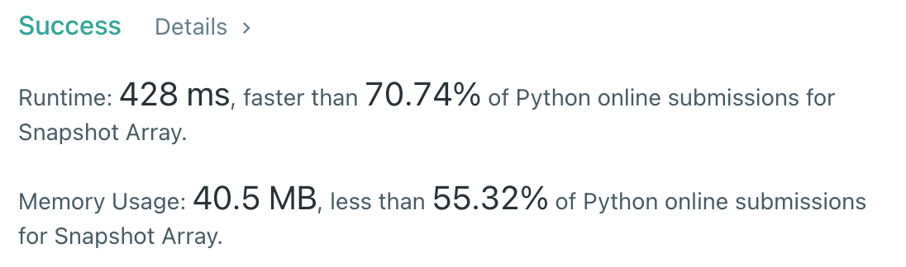

# [1146] Snapshot Array

## Info

### 결과값

| 항목        | 평가                             |
| ----------- | -------------------------------- |
| 통과        | **AC** WA                        |
| 문제 난이도 | Easy **Medium** Hard             |
| 체감 난이도 | Easy **Medium** Hard             |
| 언어        | C C++ Java **Python** Javascript |
| 해결 시간   | 약 1시간                         |
| 시간복잡도  | O(n)                             |

## Result



## Solving

어려워...😞 snap_id를 0부터 시작하게 해서 더 헷갈린다.

처음에는 그냥 아무생각 없이 snapshot 할때마다 전체 array를 slice copy해서 저장했는데, time limit 걸렸다.

그래서 생각해보다가 snapshot 할때마다 저장할 필요는 없고, 어짜피 배열이 변경되는건 `set` 연산을 할때 뿐만이므로 `set` 연산 시에만 현재 snapshot의 갯수(?)에 따라 현재 set 값을 override 할지, append 할 지를 결정해주면 된다고 생각했다.

array의 각 idx를 배열로 해서 history를 저장하되, `set` 연산 시 현재 snapShot과 array[idx]의 len을 비교한다.

- array[idx]의 len -1 < snapShot 이라면? 직전 상태가 snapshot 된 것. 따라서 set 되는 값을 append 해야 함
- 아니라면? set 되는 값을 override 해도 됨

이렇게 했다가 snapShot을 연속으로 여러번 했을 경우에서 에러가 났다. 그때 뭔가 아... 이진탐색 각인가...? 란 생각이 들긴 했지만 생각하기가 귀찮아서 그냥 `snap_id` 로 접근할 수 있게 `set` 을 extend 하는 식으로 수정했다.

## Source

```python
class SnapshotArray(object):

    def __init__(self, length):
        self.array = [[0] for i in range(length)]
        self.snapShot = 0

    def set(self, index, val):
        if self.snapShot != len(self.array[index])-1:
            self.array[index].extend([self.array[index][-1] for i in range(self.snapShot + 1 - len(self.array[index]))])
            self.array[index][-1] = val
        else:
            self.array[index][-1] = val

    def snap(self):
        self.snapShot += 1
        return self.snapShot - 1

    def get(self, index, snap_id):
        if len(self.array[index]) < snap_id + 1:
            return self.array[index][-1]
        else:
            return self.array[index][snap_id]
```

### Bisect로 푸는 법

```python
class SnapshotArray(object):

    def __init__(self, n):
        self.A = [[[-1, 0]] for _ in xrange(n)]
        self.snap_id = 0

    def set(self, index, val):
        self.A[index].append([self.snap_id, val])

    def snap(self):
        self.snap_id += 1
        return self.snap_id - 1

    def get(self, index, snap_id):
        i = bisect.bisect(self.A[index], [snap_id + 1]) - 1
        return self.A[index][i][1]
```

