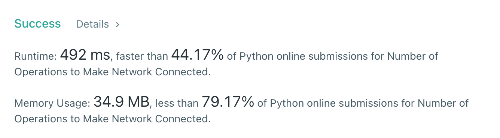

# [1319] Number of Operations to Make Network Connected

## Info

### 결과값

| 항목        | 평가                             |
| ----------- | -------------------------------- |
| 통과        | **AC** WA                        |
| 문제 난이도 | Easy **Medium** Hard             |
| 체감 난이도 | Easy **Medium** Hard             |
| 언어        | C C++ Java **Python** Javascript |
| 해결 시간   | 약 1시간                         |
| 시간복잡도  | union, find 각각의 연산당 O(n)   |

## Result



## Solving

1차적으로 union find로 각 node가 속한 집합을 찾고, 2차로 각 node를 돌면서 root가 달라서 연결이 필요한 집합을 추린다.

```python
for i in range(n):
            self.find(i)
```

2차가 필요하지 않게 union find로만 끝낼 수 있는 방법이 있는지 궁금하다 🤔

## Source

```python
class Solution(object):
    def __init__(self):
        self.parent = []

    def find(self, x):
        if self.parent[x] != x:
            self.parent[x] = self.find(self.parent[x])
        return self.parent[x]
    
    def union(self, x, y):
        x, y = self.find(x), self.find(y)
        if x < y:
            self.parent[y] = x
        else:
            self.parent[x] = y
            
    def makeConnected(self, n, connections):
        if len(connections) < n-1:
            return -1

        self.parent = [i for i in range(n)]
        
        # initiate parent arr
        self.parent = [i for i in range(n)]
        
        # union
        for x,y in connections:
            self.union(x,y)
        
        for i in range(n):
            self.find(i)
            
        return len(set(self.parent)) - 1
```

참고 링크: https://www.secmem.org/blog/2021/04/19/Union-Find-Time-Complexity-Proof/
