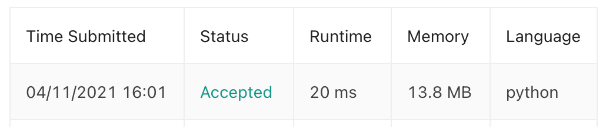

# [14] Longest Common Prefix

## Info

### 결과값

| 항목        | 평가                             |
| ----------- | -------------------------------- |
| 통과        | **AC** WA                        |
| 문제 난이도 | **Easy** Medium Hard             |
| 체감 난이도 | **Easy** Medium Hard             |
| 언어        | C C++ Java **Python** Javascript |
| 해결 시간   | 약 15분                          |
| 시간복잡도  | O(N)?                            |

## Result


## Solving

1. 첫 문자열을 candidate로 지정한다.
2. 이후 brute force로 나머지 문자열들을 순차적으로 돌면서 공통 prefix인 curr_candidate를 추려나가기 (겹치지 않을때 break)
3. 다 겹치는 경우엔 더 짧은 쪽 문자열을 curr_candidate로

## Source

```python
class Solution(object):
    def longestCommonPrefix(self, strs):
        answer = "" 
        if not len(strs):
            return answer
        curr_candidate = strs[0] # (1)
        for s in strs[1:]:
            flag = False
            minLen = min(len(curr_candidate), len(s))
            for i in range(minLen):
                if s[i] != curr_candidate[i]: # (2)
                    curr_candidate = s[:i]
                    flag = True
                    break
            if not flag:
                curr_candidate = s[:minLen] # (3)
        return curr_candidate
```

## 다른 풀이들

### 1. Horizontal scanning

내가 푼 방법. 차례차례 보면서 LCP를 찾아나가는 방법으로 상대적으로 느리다.

***LCP***(*S*1…*Sn*)=*LCP*(*LCP*(*LCP*(*S*1,*S*2),*S*3),…*Sn*)

- 시간복잡도: O(S) - S는 모든 string에 있는 문자의 수
- 공간복잡도: O(1)

### 2. Vertical scanning⭐️

위 방법이 횡적으로 문자열을 순차적으로 비교했다면, 이 방법은 모든 문자열을 직렬로 놓고 비교하는 것. 모든 문자열들에 대해 idx 0 체크, idx 1 체크...이런 식으로

- 시간복잡도: worst는 O(S)로 Horizontal scanning 방법과 같지만, best case일 때 at most O(n*minLen) (minLen은 strs에서 가장 짧은 문자열의 길이)
- 공간복잡도: O(1)

```python
class Solution(object):
    def longestCommonPrefix(self, strs):
        answer = "" 
        if not len(strs):
            return answer
        for i in range(len(strs[0])):
          c = strs[0][i]
          for j in range(1, len(strs)):
            if i == len(strs[j]) or strs[j][i] != c:
              return strs[0][:i]
        return strs[0]
```


Horizontal scanning (28ms) 보다 Vertical scanning이 (24ms) 찔끔 더 빠르다.

```python
class Solution(object):
    def longestCommonPrefix(self, strs):
        answer = "" 
        if not len(strs):
            return answer
        for i in range(len(strs[0])):
            c = strs[0][i]
            for s in strs:
                if i == len(s) or s[i] != c:
                    return answer
            answer += c
        return answer
```


- idx 대신 바로 원소로 접근
- list slicing 대신 문자열 더해가게 변경

했더니 더 빨라졌음.

### 3. Divide and conquer

위에서 봤듯이 LCP는 부분 문제들로 나뉘는 성격을 가진다.

***LCP***(*S*1…*Sn*)=*LCP*(*LCP*(*LCP*(*S*1,*S*2),*S*3),…*Sn*)

따라서 전체 strs를 반띵해서 분할정복하는 식으로 문제를 풀 수 있다.

문자열의 길이가 m인 동일한 문자열 n개가 있는 경우가 최악의 경우이다.

- 시간복잡도: O(S) - S는 모든 string에 있는 문자의 수. best case는 O(minLen*n)  (minLen은 strs에서 가장 짧은 문자열의 길이)
- 공간복잡도: O(m*logn) - 재귀적으로 함수를 호출하므로 함수 실행 스택에 메모리 오버헤드가 있다. logn번 함수를 호출해야 하고, 그 때마다 결과를 저장하기 위해 m만큼의 메모리가 필요하므로

```python
class Solution(object):
    def longestCommonPrefix(self, strs):
        answer = ""
        if not len(strs):
            return answer
        return self.lcp(strs, 0, len(strs)-1)

    def lcp(self, strs, l, r):
        if l == r:
            return strs[l]
        else:
            mid = (l+r)//2
            lcpLeft = self.lcp(strs, l, mid)
            lcpRight = self.lcp(strs, mid+1, r)
            return self.commonPrefix(lcpLeft, lcpRight)

    def commonPrefix(self, lcpLeft, lcpRight):
        minLen = min(len(lcpLeft), len(lcpRight))
        for i in range(minLen):
            if lcpLeft[i] != lcpRight[i]:
                return lcpLeft[:i]
        return lcpLeft[:minLen]
```



그 외에도 binary search, trie 등의 방법이 있음.


