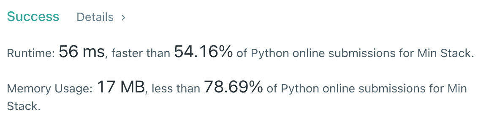

# [155] Min Stack

## Info

### 결과값

| 항목        | 평가                             |
| ----------- | -------------------------------- |
| 통과        | **AC** WA                        |
| 문제 난이도 | **Easy** Medium Hard             |
| 체감 난이도 | **Easy** Medium Hard             |
| 언어        | C C++ Java **Python** Javascript |
| 해결 시간   | 약 30분                          |
| 시간복잡도  | O(1)                             |

## Result



## Solving

처음에는 Min을 Constant Time으로 어떻게 구현해야 할지 헷갈렸다. Pop이 여러번 나올 경우를 대비해 Sorted 된 stack을 가지고 있어야 하는게 아닌가 생각했는데, 조금 더 생각해보니 Min 값을 업데이트하는건 첫 값 > 끝 값 순이고, pop은 끝 값 > 첫 값 순이니, 첫 값을 기준으로 Min stack을 쌓는다면 빈 배열이 될 때까지 pop을 해도 Min stack에는 항상 최소값이 남아있게 된다.

## Source

```python
class MinStack(object):
    stack, min_stack = None, None
    min_val = -float("inf")
    min_idx = None

    def __init__(self):
        self.stack = []
        self.min_stack = []

    def push(self, val):
        if len(self.min_stack) == 0:
            self.min_stack = [val]
        elif val <= self.min_stack[-1]:
            self.min_stack.append(val)
        self.stack.append(val)

    def pop(self):
        popped = self.stack.pop()
        if popped == self.min_stack[-1]:
            self.min_stack.pop()

    def top(self):
        return self.stack[-1]

    def getMin(self):
        return self.min_stack[-1]
```

