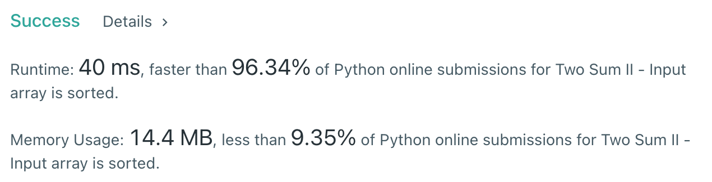

# [167] Two Sum II - Input array is sorted

## Info

### 결과값

| 항목        | 평가                             |
| ----------- | -------------------------------- |
| 통과        | **AC** WA                        |
| 문제 난이도 | **Easy** Medium Hard             |
| 체감 난이도 | **Easy** Medium Hard             |
| 언어        | C C++ Java **Python** Javascript |
| 해결 시간   | 약 30분                          |
| 시간복잡도  | O(N)                             |

## Result



시간을 얻고 공간을 잃음.

## Solving

답이 1개로 유일하므로 답을 구성하는 한 쌍을 a,b라고 했을 때 b = target-a다.

numbers 앞에서부터 하나씩 돌면서 target-a의 idx를 저장해두다가, target-a가 나오면 즉시 idx 리턴하도록 짬.

[주의사항]

- `정수`/`정수` = `정수`. 정수끼리 나눗셈 한 결과는 정수이다. 소숫점 결과물 얻고 싶다면 float 형변환 필요!
- edgecase: 문제에서 같은 값이 안나온다는 말 없었음.

## Source

```python
class Solution(object):
    def twoSum(self, numbers, target):
        negative_arr = [None for _ in range(1001)]
        positive_arr = [None for _ in range(1001)]
        mid = float(target)/2
        if len(numbers) == 2:
            return [1,2]
        else:
            for idx in range(len(numbers)):
                num = numbers[idx]
                if num < mid:
                    if num < 0:
                        negative_arr[num] = idx+1
                    else:
                        positive_arr[num] = idx+1
                elif num == mid:
                    if numbers[idx+1] == mid:
                        return [idx+1, idx+2]
                else:
                    match_num = target-num
                    if match_num < 0:
                        if negative_arr[match_num] != None:
                            return [negative_arr[match_num], idx+1]
                    else:
                        if positive_arr[match_num] != None:
                            return [positive_arr[match_num], idx+1]
```

공간복잡도를 줄일 필요가 있겠다.

