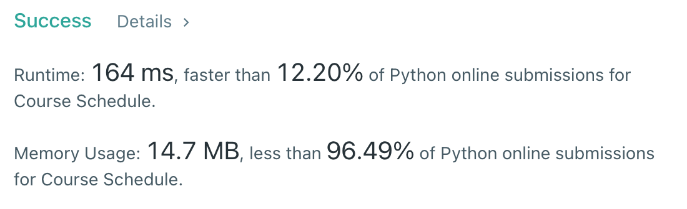

# [207] Course Schedule

## Info

### 결과값

| 항목        | 평가                             |
| ----------- | -------------------------------- |
| 통과        | **AC** WA                        |
| 문제 난이도 | Easy **Medium** Hard             |
| 체감 난이도 | Easy **Medium** Hard             |
| 언어        | C C++ Java **Python** Javascript |
| 해결 시간   | 약 30분                          |
| 시간복잡도  |                                  |

## Result



## Solving

위상정렬의 정석 같은 문제라, 위상정렬 공부한 코드 그대로 사용해서 풀었다.

근데 왜이렇게 느릴까...?🙂

## Source

```python
from collections import deque


class Solution(object):
    def canFinish(self, numCourses, prerequisites):
        v, e = numCourses, len(prerequisites)
        indegree = [0] * (v)
        graph = [[] for i in range(v)]
        result = []
        q = deque()

        for a, b in prerequisites:
            graph[b].append(a)
            indegree[a] += 1

        for i in range(v):
            if indegree[i] == 0:
                q.append(i)
        while q:
            curr_node = q.popleft()
            result.append(curr_node)
            for i in graph[curr_node]:
                indegree[i] -= 1
                if indegree[i] == 0:
                    q.append(i)

        return len(result) == numCourses
```