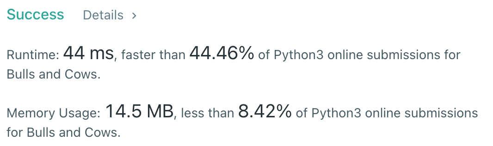

# [299] Bulls and Cows

## Info

### 결과값

| 항목        | 평가                             |
| ----------- | -------------------------------- |
| 통과        | **AC** WA                        |
| 문제 난이도 | Easy **Medium** Hard             |
| 체감 난이도 | **Easy** Medium Hard             |
| 언어        | C C++ Java **Python** Javascript |
| 해결 시간   | 약 20분                          |
| 시간복잡도  | 이진탐색 - O(logN)               |

## Result



## Solving

```
secret: "1122"
guess: "1222"
```

위 케이스를 생각 못해서 처음에 한번 틀렸다.

처음에는 secret을 앞에서부터 한번만 돌면서 bulls랑 cows를 체크했는데, 그럼 위와 같은 케이스에서 오답이 나온다.

그래서 bulls를 일단 한번 체크하고, 다음으로 cows를 체크해야 하는 식으로 변경함.

## Source

```python
class Solution(object):
    def getHint(self, secret, guess):
        bulls, cows = 0, 0
        count_nums = [0 for _ in range(10)]
        check_cows = []
        for s in secret:
            count_nums[int(s)] += 1
            
        for idx, g in enumerate(guess):
            if secret[idx] == g:
                bulls += 1
                count_nums[int(g)] -= 1
            else:
                check_cows.append(idx)
                
        for c in check_cows:
            g = int(guess[c])
            if count_nums[g] > 0:
                cows += 1
                count_nums[g] -= 1
                    
        return f"{bulls}A{cows}B"
```

