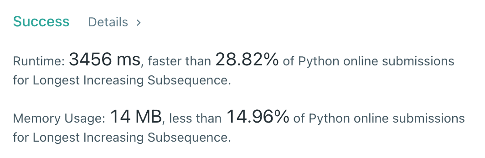

# [300] Longest Increasing Subsequence

## Info

### 결과값

| 항목        | 평가                             |
| ----------- | -------------------------------- |
| 통과        | **AC** WA                        |
| 문제 난이도 | Easy **Medium** Hard             |
| 체감 난이도 | Easy **Medium** Hard         |
| 언어        | C C++ Java **Python** Javascript |
| 해결 시간   | 1시간 |
| 시간복잡도  | O(n^2) |

## Result



## Solving

최장증가부분수열... DP의 대표격인 문제라는건 기억이 나는데 어떻게 푸는지가 도통 기억이 안났다...🤯 좀 헤매다가 기존에 DP 정리해둔거 한번 복습하고 풀었다...😢

## Source

```python
class Solution(object):
    def lengthOfLIS(self, nums):
        dp = [1 for _ in range(len(nums))]
        answer = 1
        for i in range(len(nums)):
            for j in range(i):
                if nums[j] < nums[i]:
                    dp[i] = max(dp[j]+1, dp[i])
        for d in dp:
            answer = max(d, answer)
        return answer
```

풀고 나서 찾아보니 개선된 O(nlogn) 풀이도 있는 듯 하다.