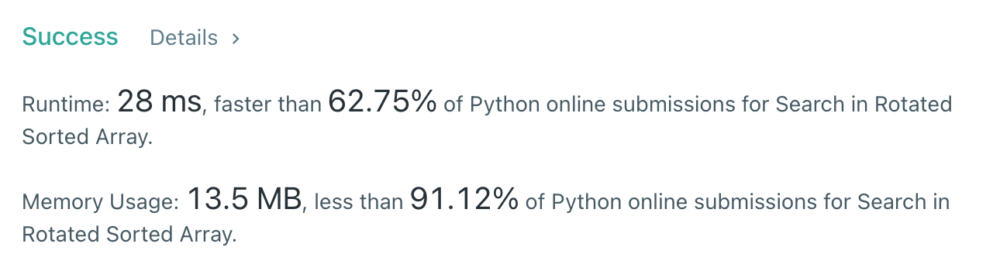

# [33] Search in Rotated Sorted Array

## Info

### 결과값

| 항목        | 평가                             |
| ----------- | -------------------------------- |
| 통과        | **AC** WA                        |
| 문제 난이도 | Easy **Medium** Hard             |
| 체감 난이도 | Easy **Medium** Hard             |
| 언어        | C C++ Java **Python** Javascript |
| 해결 시간   | 1.5시간                          |
| 시간복잡도  | 이진탐색 - O(logN)               |

## Result



## Solving

이진탐색 변형 문제라는건 감이 왔는데, 피벗의 위치를 찾아야 할지/말지 고민을 오래 했음.

고민한 결과

1. 이분탐색으로 **피벗**을 찾고
2. 피벗을 기준으로 **2개 subarray**로 나눈 뒤 (g1,g2)
3. target이 속한 subarray 내에서 다시 **이분탐색**하기

로 풀기로 함.

피벗을 어떻게 찾을 것인가에서 시간을 많이 썼는데, g1의 최댓값 찾기로 접근하면 m이 g1 범위에 속할 시 `l = m+1`, m이 g1 범위에 속하지 않을 시 `r = m-1` 을 해주는 식으로 범위를 좁혀나가는 이진탐색으로 찾을 수 있음.

단, 주의해야 할 점은 `l = m+1` 을 해줄 때 m이 피벗(증가가 끊기는 부분)인지 체크해주는 단계가 필요.

그렇게 찾은 l이 g1의 최댓값의 index가 되고, l을 기준으로 nums를 2개의 subarray(g1,g2)로 나누면 됨.

target이 nums[0] 이상이면 g1, 이하면 g2에서 이분탐색으로 찾으면 됨. 이제 g1,g2는 일반적인 증가하는 수열이므로!

## Source

```python
class Solution(object):
    def binarySearch(self, nums, target):
        l, r = 0, len(nums)-1
        while l <= r:
            m = (l+r)//2
            if target == nums[m]:
                return m
            elif target < nums[m]:
                r = m-1
            else:
                l = m+1
        return -1

    def search(self, nums, target):
        l = 0
        r = len(nums)-1
        while l < r:
            m = (l+r)//2
            if nums[m] >= nums[0]:
                if nums[m+1] >= nums[0]:
                    l = m+1
                else:
                    l = m
                    break
            else:
                r = m-1
        g1 = nums[:l+1]
        g2 = nums[l+1:]
        if target >= nums[0]:
            return self.binarySearch(g1, target)
        else:
            temp_ans = self.binarySearch(g2, target)
            if temp_ans != -1:
                return temp_ans + l + 1
            return temp_ans
```
