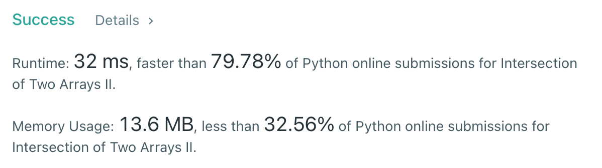

# [350] Intersection of Two Arrays II

## Info

### 결과값

| 항목        | 평가                             |
| ----------- | -------------------------------- |
| 통과        | **AC** WA                        |
| 문제 난이도 | **Easy** Medium Hard             |
| 체감 난이도 | **Easy** Medium Hard             |
| 언어        | C C++ Java **Python** Javascript |
| 해결 시간   | 약 10분                          |
| 시간복잡도  | O(N)                           |

## Result



## Solving

두 array 모두 정렬 후, 길이가 더 작은 array 기준으로 한 숫자(num)씩 보면서, 비교하는 array의 pointer가 num 이상인 숫자를 가르킬 때까지 증가시키며 비교하는 식으로 풀었습니다. 

## Source

```python
class Solution(object):
    def intersect(self, nums1, nums2):
        nums1.sort()
        nums2.sort()
        target_arr = None
        compare_arr = None
        if len(nums1) < len(nums2):
            target_arr = nums1
            compare_arr = nums2
        else:
            target_arr = nums2
            compare_arr = nums1
        pointer = 0
        answer = []
        for num in target_arr:
            while pointer < len(compare_arr) and compare_arr[pointer] < num:
                pointer += 1
            if pointer == len(compare_arr):
                break
            if compare_arr[pointer] == num:
                answer.append(num)
                pointer += 1
        return answer
```

