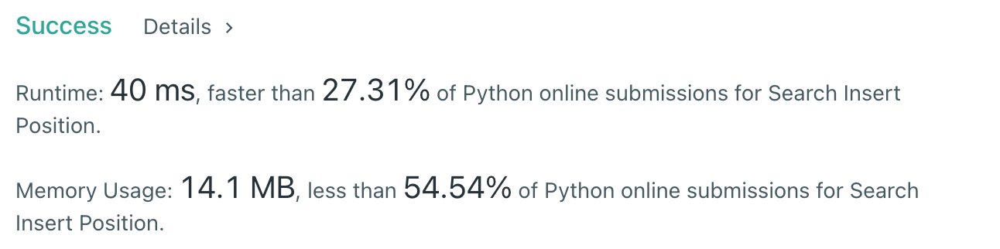

# [35] Search Insert Position

## Info

### 결과값

| 항목        | 평가                             |
| ----------- | -------------------------------- |
| 통과        | **AC** WA                        |
| 문제 난이도 | **Easy** Medium Hard             |
| 체감 난이도 | **Easy** Medium Hard             |
| 언어        | C C++ Java **Python** Javascript |
| 해결 시간   | 약 15분                          |
| 시간복잡도  | 이진탐색 - O(logN)               |

## Result



## Solving

이진탐색으로 풀었음.

l > r이 됐을때 마지막에 index를 뭘로 잡아야하나 헷갈렸는데 테케 몇번 써보고 파악.

## Source

```python
class Solution(object):
    def searchInsert(self, nums, target):
        l, r, mid = 0, len(nums)-1, 0
        while l <= r:
            mid = (l+r) // 2
            if target < nums[mid]:
                r = mid-1
            elif target > nums[mid]:
                l = mid+1
            else:
                return mid
        return l
```
