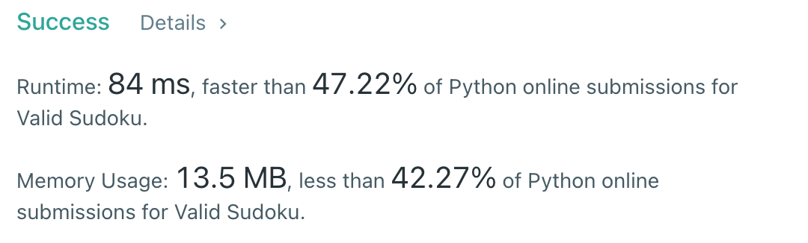

# [36] Valid Sudoku

## Info

### 결과값

| 항목        | 평가                             |
| ----------- | -------------------------------- |
| 통과        | **AC** WA                        |
| 문제 난이도 | Easy **Medium** Hard             |
| 체감 난이도 | **Easy** Medium Hard     |
| 언어        | C C++ Java **Python** Javascript |
| 해결 시간   | 30분 |
| 시간복잡도  | O(n^2) |

## Result



## Solving

## Source

```python
class Solution(object):
    def isValidRow(self, board):
        for row in board:
            chk = [False for _ in range(10)]
            for i in row:
                if i == '.':
                    continue
                target = int(i)
                if chk[target] == False:
                    chk[target] = True
                else:
                    return False
        return True
    
    def isValidColumn(self, board):
        for i in range(9):
            chk = [False for _ in range(10)]
            for row in board:
                if row[i] == '.':
                    continue
                target = int(row[i])
                if chk[target] == False:
                    chk[target] = True
                else:
                    return False
        return True
      
    def isValidSubBox(self,board):
        for x in range(0, 9, 3):
            for y in range(0, 9, 3):
                chk = [False for _ in range(10)]
                for i in range(x, x+3):
                    for j in range(y, y+3):
                        if board[i][j] == '.':
                            continue
                        target = int(board[i][j])
                        if chk[target] == False:
                            chk[target] = True
                        else:
                            return False             
        return True
            
    def isValidSudoku(self, board):
        return self.isValidRow(board) and self.isValidColumn(board) and self.isValidSubBox(board)
```

쉬어가는 시뮬레이션 문제(?) 그냥 하라는대로 구현했다.

