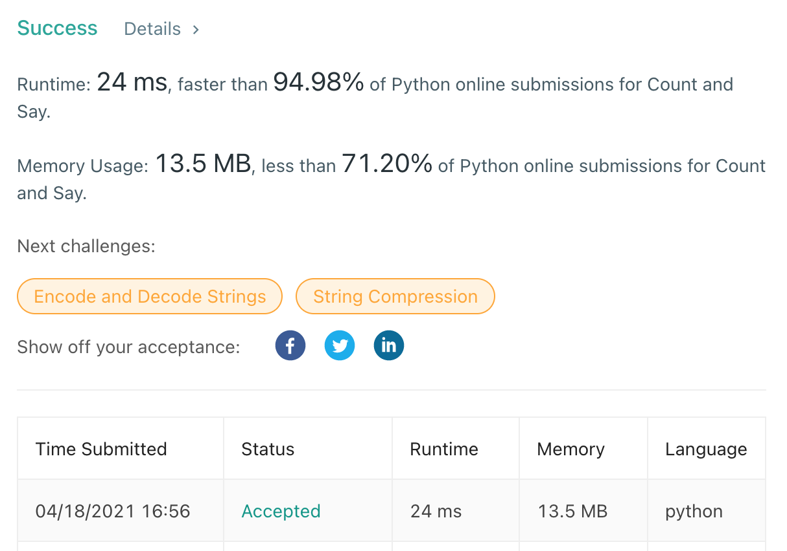

# [38] Count and Say

## Info

### 결과값

| 항목        | 평가                                |
| ----------- | ----------------------------------- |
| 통과        | **AC** WA                           |
| 문제 난이도 | Easy **Medium** Hard                |
| 체감 난이도 | **Easy** Medium Hard                |
| 언어        | C C++ Java **Python** Javascript    |
| 해결 시간   | 약 15분                             |
| 시간복잡도  | 🤔 O(n)...? 인가...? 잘 모르겠습니다 |

## Result



## Solving

bottom-up으로 ans[0] = 1로 두고, n값까지 차례로 구하면서 풀었음.

문제에서 주어진 대로 `ans[i] = say(ans[i-1])` 이라는 점화식을 세우고 풀었다.

## Source

```python
class Solution(object):
    def say(self, n):
        ans = []
        str_n = str(n)
        curr_char = str_n[0]
        curr_count = 1
        for char in str(n)[1:]:
            if char == curr_char:
                curr_count += 1
            else:
                ans.extend([str(curr_count), curr_char])
                curr_char = char
                curr_count = 1
        ans.extend([str(curr_count), curr_char])
        return ''.join(ans)

    def countAndSay(self, n):
        ans = ["1"]
        i = 1
        while len(ans) < n:
            ans.append(self.say(ans[i-1]))
            i += 1
        return ans[-1]
```

