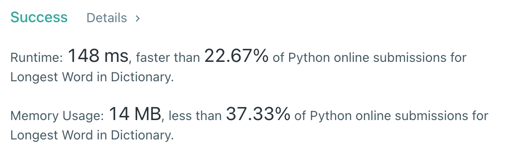

# [40] Combination Sum II

## Info

### 결과값

| 항목        | 평가                             |
| ----------- | -------------------------------- |
| 통과        | **AC** WA                        |
| 문제 난이도 | Easy **Medium** Hard             |
| 체감 난이도 | Easy Medium Hard             |
| 언어        | C C++ Java **Python** Javascript |
| 해결 시간   | 약 30분                          |
| 시간복잡도  | O(N)?                            |

## Result



## Solving

풀이가 떠오르지 않아서 Discussion을 참고하여 풀었다 T_T

DFS 까지는 알겠는데, Duplicate한 조합들을 도통 어떻게 선별을 해야 하나...했는데 답은 **sorting**에 있었다.`

기본적으로 idx 0부터 하나씩 첫번째 값으로 path에 넣어가며 target 값을 완성해나가되, **첫번째 후보가 아닌데 전 값과 같다면 duplicate이므로 처리하지 않고 넘어**간다. 이게 가능한 건 nums를 sort 해두었기 때문이다.

```python
for i in range(idx, len(nums)):
  if i > idx and nums[i] == nums[i-1]: # 첫번째 후보가 아닌데 전값과 같다면 duplicate!
    continue
    self.dfs(nums, target-nums[i], i+1, path+[nums[i]], result)
```

재귀는 여전히 어렵다 ;-;

## Source

```python
class Solution(object):
    def combinationSum2(self, candidates, target):
        result = []
        self.dfs(sorted(candidates), target, 0, [], result)
        return result
    
    def dfs(self, nums, target, idx, path, result):
        if target < 0:
            return
        if target == 0:
            result.append(path)
            return
        for i in range(idx, len(nums)):
            if i > idx and nums[i] == nums[i-1]:
                continue
            self.dfs(nums, target-nums[i], i+1, path+[nums[i]], result)
```
