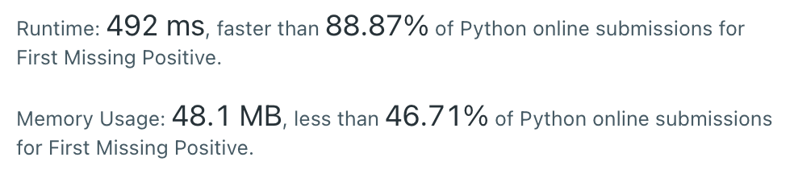

# [75] Sort Colors

## Info

### 결과값

| 항목        | 평가                             |
| ----------- | -------------------------------- |
| 통과        | **AC** WA                        |
| 문제 난이도 | Easy Medium **Hard**             |
| 체감 난이도 | Easy **Medium** Hard             |
| 언어        | C C++ Java **Python** Javascript |
| 해결 시간   | 약 30분                          |
| 시간복잡도  | O(N)                             |

## Result



## Solving

sort를 해버리고 풀어서 그런가... hard 치고 이상하게 빨리 풀었다. 이 문제가 hard인 이유가 있을텐데...🤨 sort를 쓰면 안되는 문제인가..?

discussion을 좀 봐야겠다.

## Source

```python
class Solution(object):
    def firstMissingPositive(self, nums):
        nums.sort()
        needed_next = 1
        for num in nums:
            if num == needed_next:
                needed_next += 1
            if num > needed_next:
                return needed_next
        return needed_next
```

