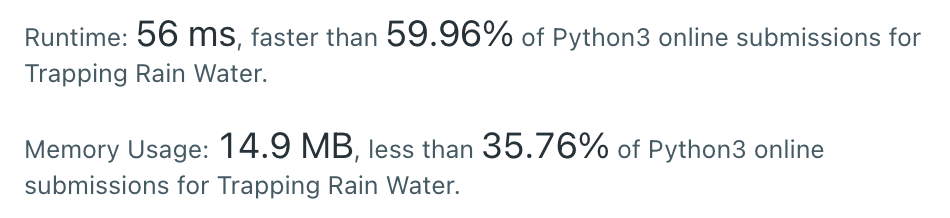

# [42] Trapping Rain Water

## Info

### 결과값

| 항목        | 평가                             |
| ----------- | -------------------------------- |
| 통과        | **AC** WA                        |
| 문제 난이도 | Easy Medium **Hard**             |
| 체감 난이도 | Easy Medium **Hard**             |
| 언어        | C C++ Java **Python** Javascript |
| 해결 시간   | 약 30분                          |
| 시간복잡도  | O(N)                             |

## Result




## Solving

왼쪽 끝, 오른쪽 끝에 포인터를 두고, l_max 값과 r_max 값을 추적한다.

그리고 l == r이 될 때까지

- [현재 l의 높이, 누적 l_max 값] 중 큰 값이 l_max
- [현재 r의 높이와, 누적 r_max 값] 중 큰 값이 r_max
- l_max, r_max 중 작은 값 기준으로 물이 고이게 되어있음. 둘 중 작은값 - 해당 위치의 높이가 물 고인 양.
- 둘 중 작은 값의 포인터를 안쪽으로 이동시킴

을 반복한다.

예전에 강의 들으면서 풀어본 문제였는데, 다시 읽어봐도 떠올리기 쉽지 않은 아이디어인것 같다.

## Source

```python
class Solution:
    def trap(self, height: List[int]) -> int:
        if not height:
            return 0
        answer = 0
        l,r = 0, len(height)-1
        l_max, r_max = height[l], height[r]
        while l < r:
            l_max = max(l_max, height[l])
            r_max = max(r_max, height[r])
            if l_max <= r_max:
                answer += l_max - height[l]
                l += 1
            else:
                answer += r_max - height[r]
                r -= 1
        return answer
```

