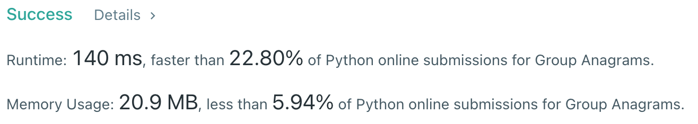

# [49] Group Anagrams

## Info

### 결과값

| 항목        | 평가                             |
| ----------- | -------------------------------- |
| 통과        | **AC** WA                        |
| 문제 난이도 | Easy **Medium** Hard            |
| 체감 난이도 | Easy **Medium** Hard            |
| 언어        | C C++ Java **Python** Javascript |
| 해결 시간   | 약 30분                          |
| 시간복잡도  | O(N)                             |

## Result



## Solving

anagram이려면 ord

## Source

```python
class Solution(object):
    def getORD(self, char):
        return ord(char)-97
    
    def groupAnagrams(self, strs):
        arr = []
        answer = []
        for s in strs:
            ordNum = [0 for _ in range(26)]
            for c in s:
                ordNum[self.getORD(c)] += 1
            arr.append([s, ordNum])
        arr.sort(key=lambda x:x[1])
        curr_ord = None
        curr_arr = []
        for a in arr:
            if not curr_ord:
                curr_ord = a[1]
                curr_arr.append(a[0])
            elif a[1] == curr_ord:
                curr_arr.append(a[0])
            else:
                answer.append(curr_arr)
                curr_arr = [a[0]]
                curr_ord = a[1]
        if len(curr_arr):
            answer.append(curr_arr)
        return answer
```

비트마스크처럼, str을 ord의 조합으로 표현한 ordNum을 사용해 anagram 여부를 식별했다. 이 아이디어까지는 괜찮았는데 결과적으로 불필요한 로직들이 좀 들어간 것 같다. any order로 리턴해도 되는데 sort를 한 것이나, ordNum을 배열에 다 쌓아두지 말고 ordNum을 만들면서 동시에 key 값으로 사용해서 dict를 완성했다면 마지막 for 로직은 아예 없어도 될텐데, 그 생각을 못했던 것이 좀 아쉽다.

## 다른 풀이

```python
class Solution:
    def groupAnagrams(self, strs):
        hmap = collections.defaultdict(list)
        for st in strs:
            array = [0] * 26
            for l in st:
                array[ord(l) - ord('a')] += 1
            hmap[tuple(array)].append(st)
        return hmap.values()
```

