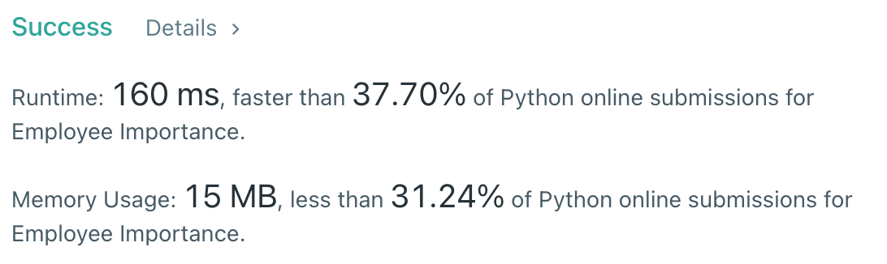

# [690] Employee Importance

## Info

### 결과값

| 항목        | 평가                             |
| ----------- | -------------------------------- |
| 통과        | **AC** WA                        |
| 문제 난이도 | **Easy** Medium Hard             |
| 체감 난이도 | **Easy** Medium Hard             |
| 언어        | C C++ Java **Python** Javascript |
| 해결 시간   | 약 20분                          |
| 시간복잡도  | O(V+E)                           |

## Result



## Solving

111번과 비슷하게 deque를 사용한 BFS로 풀었는데,  id 값으로 주어지는 int가 1부터 시작해서 1씩 증가하는건지, 또 id 기준으로 employees가 정렬되어(?) 들어오는지 등의 정보가 없어서 dictionary (map)를 사용했습니다. 문제가 좀 불친절한 것 같습니다.😾

## Source

```python
from collections import deque

class Solution(object):
    def getImportance(self, employees, id):
        answer = 0
        idx_arr = {}
        for e in employees:
            idx_arr[e.id] = [e.importance, e.subordinates]
        q = deque([id])
        while q:
            imp, sub = idx_arr[q.popleft()]
            answer += imp
            q.extend(sub)
        return answer
```

