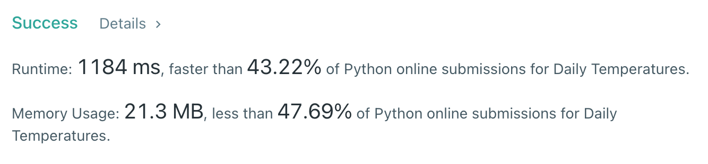

# [739] Daily Temperatures

## Info

### 결과값

| 항목        | 평가                             |
| ----------- | -------------------------------- |
| 통과        | **AC** WA                        |
| 문제 난이도 | Easy **Medium** Hard             |
| 체감 난이도 | Easy **Medium** Hard             |
| 언어        | C C++ Java **Python** Javascript |
| 해결 시간   | 약 30분                          |
| 시간복잡도  | 얼마죠...?                       |

## Result



## Solving

잘 모르겠어서 Related Topics를 보고 스택 문제라는 힌트를 얻었다... ^.^

Temperatures의 앞부터 stack에 넣어가며, 넣을 때마다 stk의 위를 보면서 자기보다 작은 애는 pop 한다. 이렇게 넣으면 stk은 항상 내림차순일 수밖에 없다.

## Source

```python
class Solution(object):
    def dailyTemperatures(self, temperatures):
        stk = []
        arr = [0]*len(temperatures)
        for idx, v in enumerate(temperatures):
            while stk and stk[-1][1] < v:
                target = stk.pop()
                arr[target[0]] = idx - target[0]
            stk.append([idx, v])
        return arr
```
