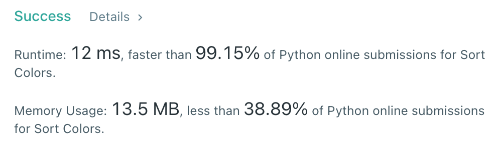

# [75] Sort Colors

## Info

### 결과값

| 항목        | 평가                             |
| ----------- | -------------------------------- |
| 통과        | **AC** WA                        |
| 문제 난이도 | Easy **Medium** Hard             |
| 체감 난이도 | **Easy** Medium Hard             |
| 언어        | C C++ Java **Python** Javascript |
| 해결 시간   | 약 30분                          |
| 시간복잡도  | O(N)                             |

## Result



## Solving

one-pass algorithm 으로 어떻게 풀지 고민하면서 30분을 보냈지만 떠오르지 않았다🤔

two-pass로 `O(2N)` 첫번째 돌때 0,1,2 갯수 찾고, 두번째 돌때 0,1,2 차례대로 nums에 override 하는 식으로 풀었다.

## Source

```python
class Solution(object):
    def sortColors(self, nums):
        RED, WHITE, BLUE = 0, 1, 2
        num_R, num_W, num_B = 0, 0, 0
        for num in nums:
            if num == RED:
                num_R += 1
                nums[num_R-1] = 0
            elif num == WHITE:
                num_W += 1
            elif num == BLUE:
                num_B += 1
        next_idx = num_R
        while num_W:
            nums[next_idx] = 1
            next_idx += 1
            num_W -= 1
        while num_B:
            nums[next_idx] = 2
            next_idx += 1
            num_B -= 1
        return nums
```

## Solution

[dutch partitioning problem](https://en.wikipedia.org/wiki/Dutch_national_flag_problem) 이라고 한다. 

원소가 0,1,2 3개 밖에 존재하지 않으므로 가능한 solution이다.

red, white, blue 포인터를 두고 원소를 swap해가는 방법.

```python
def sortColors(self, nums):
    red, white, blue = 0, 0, len(nums)-1
    
    while white <= blue:
        if nums[white] == 0:
            nums[red], nums[white] = nums[white], nums[red]
            white += 1
            red += 1
        elif nums[white] == 1:
            white += 1
        else:
            nums[white], nums[blue] = nums[blue], nums[white]
            blue -= 1
```

까지 봤는데 8시 55분이네요 추후 정리하겠습니다 