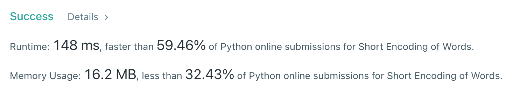

# [820] Short Encoding of Words

## Info

### 결과값

| 항목        | 평가                             |
| ----------- | -------------------------------- |
| 통과        | **AC** WA                        |
| 문제 난이도 | Easy **Medium** Hard             |
| 체감 난이도 | Easy **Medium** Hard             |
| 언어        | C C++ Java **Python** Javascript |
| 해결 시간   | 1시간                            |
| 시간복잡도  | O(L) (*L: 전체 문자열의 길이)    |

## Result



## Solving

word[i] 가 다른 word의 **postfix**라면 encoding에서 생략이 가능하므로, 단어를 뒤집어서 trie로 풀었다. 

- trie에 없는 단어가 새롭게 insert 될 때는 - encoding에서 축약될 수 없으므로 `answer += len(단어) + 1` 이다.  1을 더하는 이유는 단어 끝에 `#` 가 붙기 때문.
- trie에 있는 단어라는 것은  = 해당 단어가 기존 단어의 postfix라는 것 = encoding에서 축약되므로 answer이 증가하지 않음ㄴ

처음 풀었을 때 `["me", "time"]` 테케에서 틀렸는데, 그 이유는 words를 길이 순으로 sort 하지 않아서였다. words를 길이 순으로 sort해주니 AC.

## Source

```python
class Trie:
    def __init__(self):
        self.root = {}

    def insert(self, string):
        cur_node = self.root
        for i, char in enumerate(string):
            if char not in cur_node:
                cur_node[char] = {}
            elif i == len(string)-1:
                return True
            cur_node = cur_node[char]
        return False

class Solution(object):
    def minimumLengthEncoding(self, words):
        words.sort(key=lambda x : -len(x))
        trie = Trie()
        answer = 0
        for word in words:
            result = trie.insert(word[::-1])
            if not result:
                answer += len(word) + 1
        return answer
```

