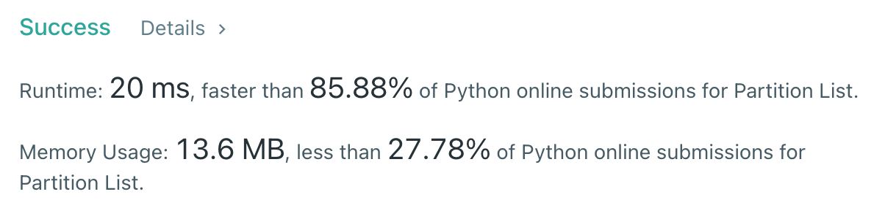

# [86] Partiton List

## Info

### 결과값

| 항목        | 평가                             |
| ----------- | -------------------------------- |
| 통과        | **AC** WA                        |
| 문제 난이도 | Easy **Medium** Hard             |
| 체감 난이도 | **Easy** Medium Hard             |
| 언어        | C C++ Java **Python** Javascript |
| 해결 시간   | 약 30분                          |
| 시간복잡도  | O(N)                             |

## Result



## Solving

급하게 푸느라 예외처리가 덕지덕지인게 예쁘게 짜지 못한 것 같지만... 일단은 head 부터 linkedList를 타고 쭉 탐색하면서 x 기준으로 작으면 lessThan 리스트에, 같거나 크면 greaterThan 리스트에 붙여가면서 풀었다.

그리고 마지막엔 lessThan에 greaterThan을 붙여 리턴.

## Source

```python
class Solution(object):
    def partition(self, head, x):
        lessThan = ListNode()
        greaterThan = ListNode()
        currLessThan, currGreaterThan = lessThan, greaterThan
        currNode = head
        lessThanTail = None
        if head == None:
            return None
        if head.next == None:
            return head
        while currNode != None:
            if currNode.val < x:
                currLessThan.next = ListNode(currNode.val)
                currLessThan = currLessThan.next
                lessThanTail = currLessThan
            else:
                currGreaterThan.next = ListNode(currNode.val)
                currGreaterThan = currGreaterThan.next
            currNode = currNode.next
        if lessThanTail == None:
            return greaterThan.next
        lessThanTail.next = greaterThan.next
        return lessThan.next
```

