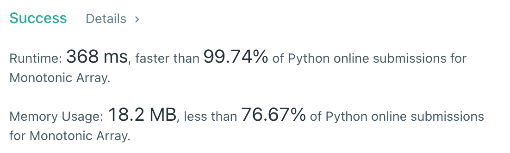

# [896] Monotonic Array

## Info

### 결과값

| 항목        | 평가                             |
| ----------- | -------------------------------- |
| 통과        | **AC** WA                        |
| 문제 난이도 | **Easy** Medium Hard             |
| 체감 난이도 | **Easy** Medium Hard             |
| 언어        | C C++ Java **Python** Javascript |
| 해결 시간   | 5분                              |
| 시간복잡도  | O(n)                             |

## Result



## Solving

nums의 첫 요소랑 마지막 요소를 비교해서 increasing인지 decreasing인지를 찾아내고, nums를 돌면서 그 패턴을 지키는지 확인!

## Source

```python
class Solution(object):
    def isMonotonic(self, nums):
        prev = nums[0]
        flag = None
        if nums[0] > nums[-1]:
            flag = -1
        else:
            flag = 1
        for num in nums:
            if num == prev:
                continue
            elif flag == 1 and num > prev:
                prev = num
            elif flag == -1 and num < prev:
                prev = num
            else:
                return False
        return True
```

