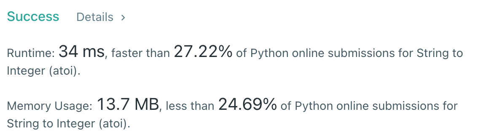

# [8] String to Integer (atoi)

## Info

### 결과값

| 항목        | 평가                             |
| ----------- | -------------------------------- |
| 통과        | **AC** WA                        |
| 문제 난이도 | Easy **Medium** Hard             |
| 체감 난이도 | **Easy** Medium Hard         |
| 언어        | C C++ Java **Python** Javascript |
| 해결 시간   | 30분                          |
| 시간복잡도  | O(N)                            |

## Result

.assets/image-20211018204314479.png)



## Solving

조건문 파티...

## Source

```python
class Solution(object):
    def myAtoi(self, s):
        isNegative = 1
        max_limit = 2**31-1
        min_limit = -2**31
        answer = ""
        
        if len(s) == 0:
            return 0
        
        for i in range(len(s)):
            if s[i] == " ":
                continue
            s = s[i:]
            break

        if s[0] == '-' or s[0] == "+":
            if s[0] == "-":
                isNegative = -1
            s = s[1:]
        
        for i in range(len(s)):
            if s[i].isnumeric():
                answer += s[i]
            else:
                break
        
        if len(answer):
            answer = int(answer)*isNegative
        else:
            return 0
        
        if answer > max_limit:
            return max_limit
        elif answer < min_limit:
            return min_limit
        else:
            return answer
```
