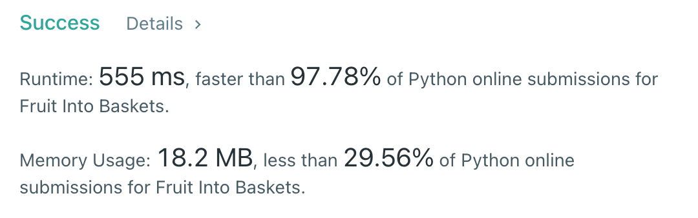

# [904] Fruit Into Baskets

## Info

### 결과값

| 항목        | 평가                             |
| ----------- | -------------------------------- |
| 통과        | **AC** WA                        |
| 문제 난이도 | Easy **Medium** Hard             |
| 체감 난이도 | Easy **Medium** Hard         |
| 언어        | C C++ Java **Python** Javascript |
| 해결 시간   | 약 1시간 30분                   |
| 시간복잡도  | O(N)?                            |

## Result



Runtime이랑 Memory는 제출할 때마다 매번 바뀌는데 운좋게 555ms를 겟또했다 (ㅋㅋㅋㅋㅋ)

## Solving

어려웠다...

sliding window(?) 투포인터(?)로 풀었다. 2종류의 fruit만을 포함하는 범위 l,r을 두고 l~r 사이의 간격의 max 를 구하는 방식.

처음에 삽질도 많이 하고 너무 좀 쉽게 생각했다가, `[1,0,1,4,1,4,1,2,3]` 반례를 보고 깊은 고민에 빠졌다...

연속하는 과일의 가짓수가 3개 이상이 되어, 새로운 fruit 조합으로 바뀔 때 "기존에 들고 있던 fruit 갯수를 어떻게 추적 할 것인가" 가 고민이었다. 예를 들어 위 반례에서 [1,0] 에서 [1,4] 로 바뀔 때 기존에 1이 얼마나 연속하는지 어떻게 파악 할 것인가...!

고민 끝에 그냥 새로운 fruit 조합으로 바뀔 때 (r이 3번째 fruit을 가르킬 때) while문을 사용해서 기존의 r을 기준으로 새로운 l을 찾아내도록 변경했다. r-1까지는 기존 조합이므로, r-1을 next_l로 삼고  다른 fruit이 등장하기 직전까지 1씩 줄여나간다.

예를 들어 `1,2,1,2,2,2,3,3` 와 같은 테스트 케이스에서는

- r = 6
- next_l = 5에서 시작해 3까지 감소

## Source

```python
class Solution(object):
    def totalFruit(self, fruits):
        l,r = 0,1
        max_v = 1
        arr = [fruits[l]]
        if len(fruits) < 3:
            return len(fruits)
        for r in range(1, len(fruits)):
            if fruits[r] in arr:
                continue
            elif len(arr) < 2:
                arr += [fruits[r]]
            else:
                max_v = max(max_v, r-l)
                next_l = r-1
                while next_l > -1 and fruits[next_l] == fruits[r-1]:
                    next_l -= 1
                l = next_l+1
                arr = [fruits[l], fruits[r]]
        max_v = max(max_v, r-l+1)
        return max_v
```

### arr 매번 새로 만들지 않는 코드

```python
class Solution(object):
    def totalFruit(self, fruits):
        l,r = 0,1
        max_v = 1
        arr = [fruits[l]]
        if len(fruits) < 3:
            return len(fruits)
        for r in range(1, len(fruits)):
            if fruits[r] in arr:
                continue
            elif len(arr) < 2:
                arr += [fruits[r]]
            else:
                max_v = max(max_v, r-l)
                next_l = r-1
                while fruits[next_l] == fruits[r-1]:
                    next_l -= 1
                dropped_fruit = next_l
                l = next_l+1
                arr.remove(fruits[dropped_fruit])
                arr.append(fruits[r])
        max_v = max(max_v, r-l+1)
        return max_v
```

