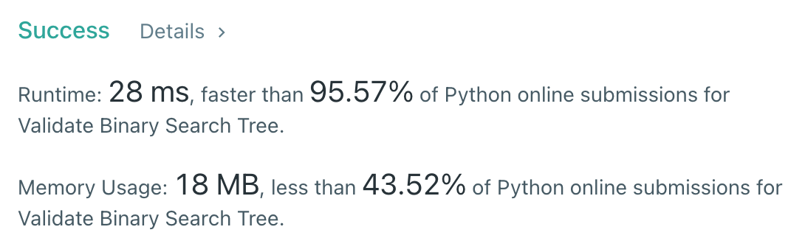

# [98] Validate Binary Search Tree

## Info

### 결과값

| 항목        | 평가                             |
| ----------- | -------------------------------- |
| 통과        | **AC** WA                        |
| 문제 난이도 | Easy **Medium** Hard             |
| 체감 난이도 | Easy **Medium** Hard             |
| 언어        | C C++ Java **Python** Javascript |
| 해결 시간   | 30분                             |
| 시간복잡도  | O(N)                             |

## Result



## Solving

주어진 트리가 BST인지를 확인하는 문제. 예전에 풀어본 기억이 있어 재귀로 풀었다.

lower bound 값 (largerThan), upper bound 값 (lessThan) 을 계속 isValidBST에 넘겨주면서, 왼쪽 자식으로 갈 때는 upper bound 값을 업데이트하고, 오른쪽 자식으로 갈 때는 lower bound 값을 업데이트 한다.

## Source

```python
class Solution(object):
    def isValidBST(self, root, largerThan = float('-inf'), lessThan = float('inf')):
        if not root:
            return True
        if root.val <= largerThan or root.val >= lessThan:
            return False
        return self.isValidBST(root.left, largerThan, min(lessThan, root.val)) and self.isValidBST(root.right, max(root.val, largerThan), lessThan)
```

