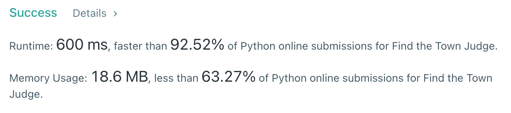

# [997] Find the Town Judge

## Info

### 결과값

| 항목        | 평가                             |
| ----------- | -------------------------------- |
| 통과        | **AC** WA                        |
| 문제 난이도 | **Easy** Medium Hard             |
| 체감 난이도 | **Easy** Medium Hard             |
| 언어        | C C++ Java **Python** Javascript |
| 해결 시간   | 5분                              |
| 시간복잡도  | O(n)                             |

## Result



## Solving

trusted_arr, trust_arr을 돌면서 한명도 믿지 않지만 모두에게 믿음받는 사람 골라내기.

trust가 빈 배열일때 예외처리 틀려서 다시함.

## Source

```python
class Solution(object):
    def findJudge(self, n, trust):
        if len(trust) == 0 and n == 1:
                return 1
        trusted_arr = [0 for _ in range(n+1)]
        trust_arr = [False for _ in range(n+1)]
        candidate_arr = []
        for [a,b] in trust:
            trust_arr[a] = True
            trusted_arr[b] += 1
            if trusted_arr[b] == n-1:
                candidate_arr.append(b)
        for c in candidate_arr:
            if trust_arr[c] == False:
                return c
        return -1
```

